# LAMP搭建

##  1、linux搭建

在官网下载镜像

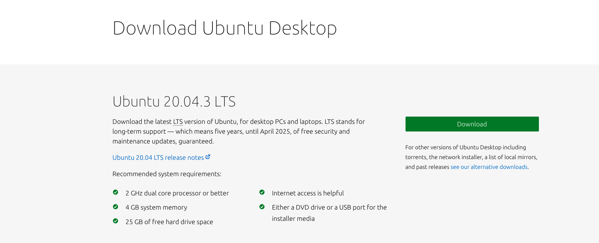

安装到虚拟机

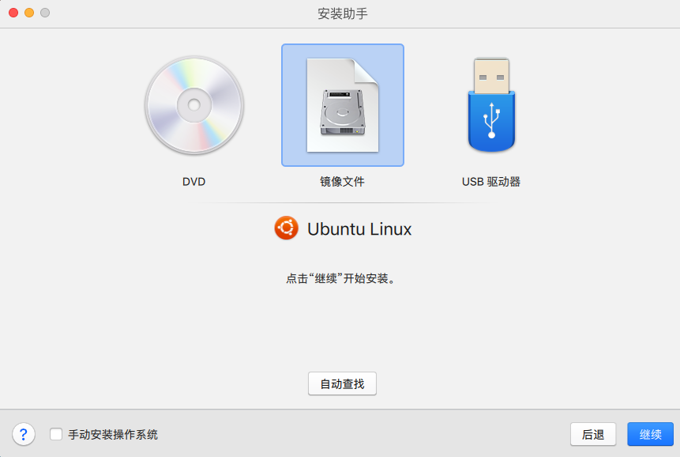

安装的界面

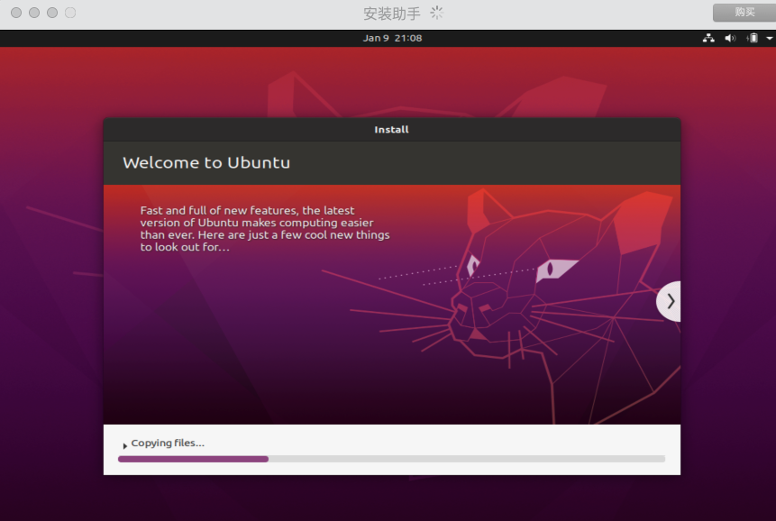

安装完成

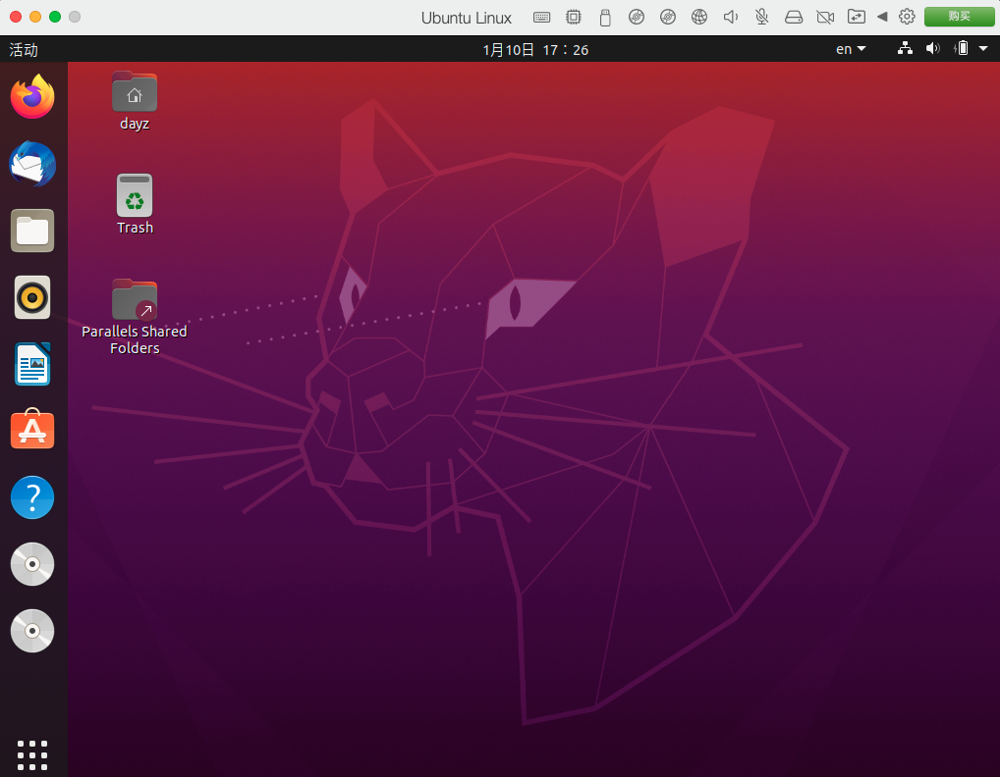

## 2、Apache搭建

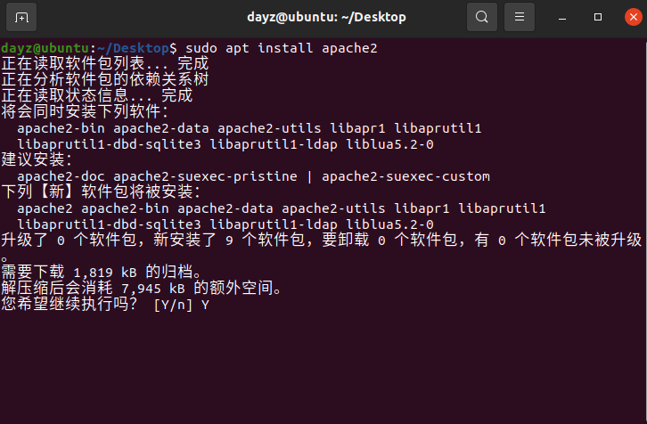

通过ip访问查看apache是否搭建成功

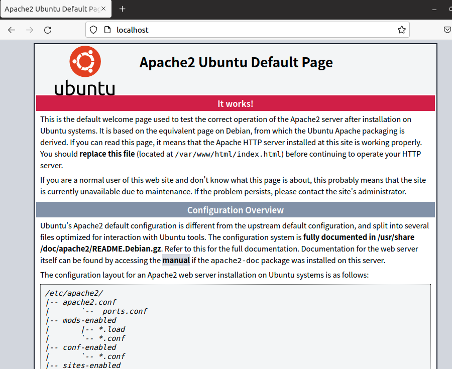

设置为开机自动启动

## 3、MYSQL的搭建

下载安装mysql

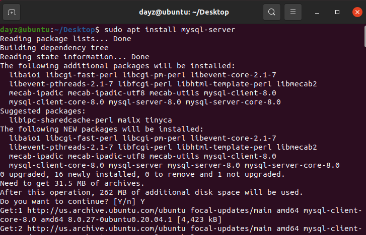

检测是否安装成功

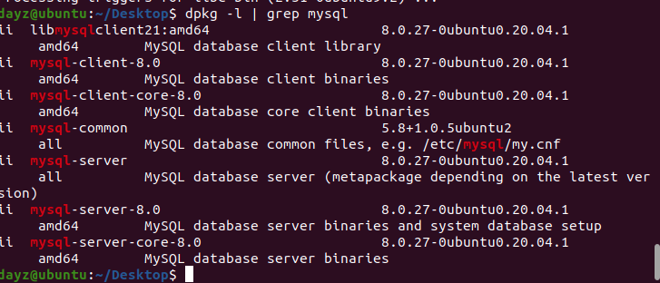

查看登录的密码

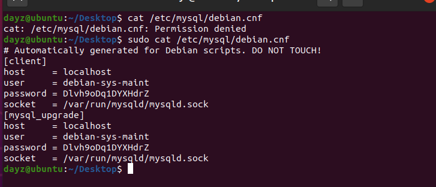

登录成功

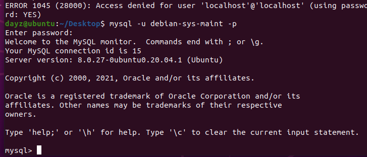

修改用户的密码

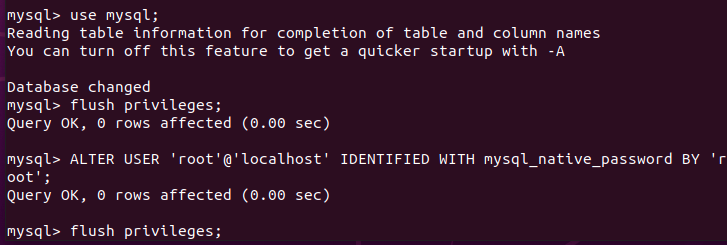

## 4、PHP的搭建

安装PHP

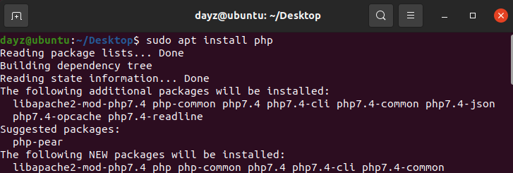

检测是否安装成功

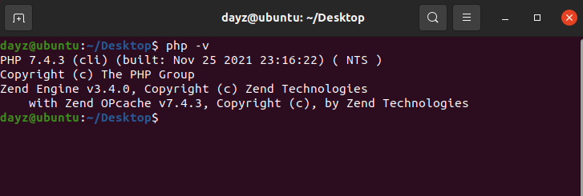

修改Apache的首页，使其首页为index.php

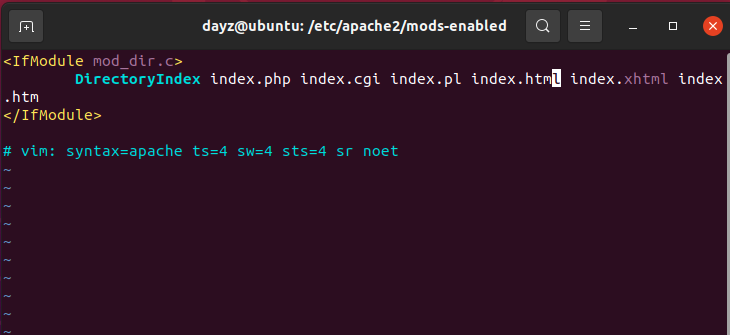

编写index.php

显示phpinfo消息

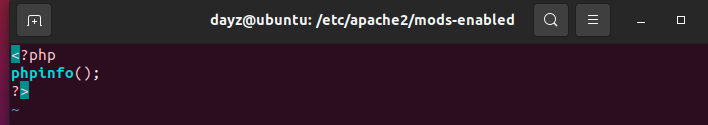

搭建成功

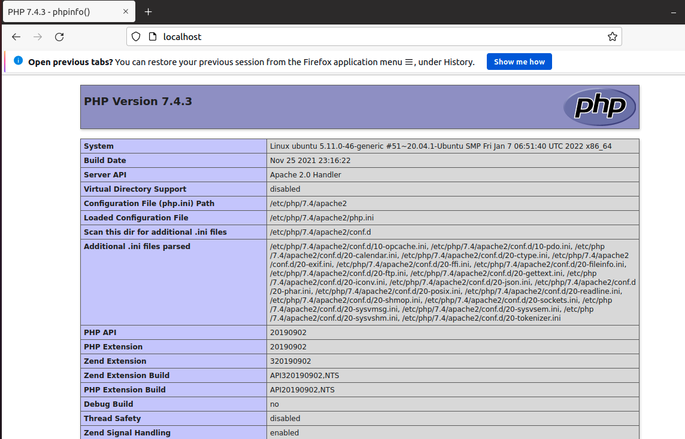
